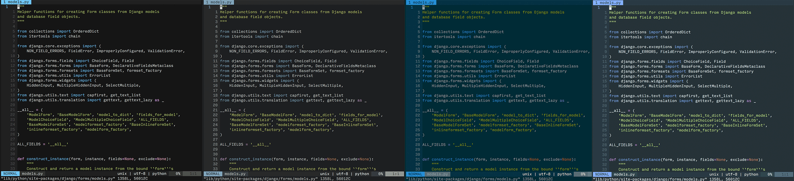

# base16-vim-lightline

Provides [lightline.vim](https://github.com/itchyny/lightline.vim) colorschemes
for all the [base16](http://chriskempson.com/projects/base16/) themes.



## Installation/Usage

This is a simple vim plugin, so including it in your `vimrc` or `nvim/init.vim`
should suffice. If you use [vim-plug](https://github.com/junegunn/vim-plug):

```vim
Plug 'chriskempson/base16-vim'
Plug 'mike-hearn/base16-vim-lightline'
```

## How to build

The `Dockerfile`/`docker-compose.yml` files contained in this repo will automatically
pull the latest base16 theme templates from github and build them (using
[base16-builder-go](https://github.com/belak/base16-builder-go)).

This repo will be kept somewhat up-to-date, but if you wish to build using the
latest available themes, run:

```sh
docker-compose up
```

This will kick-off a container that will pull the themes, build the lightline
colorschemes, and output them to the proper local directory (e.g.
./autoload/lightline/colorscheme).
